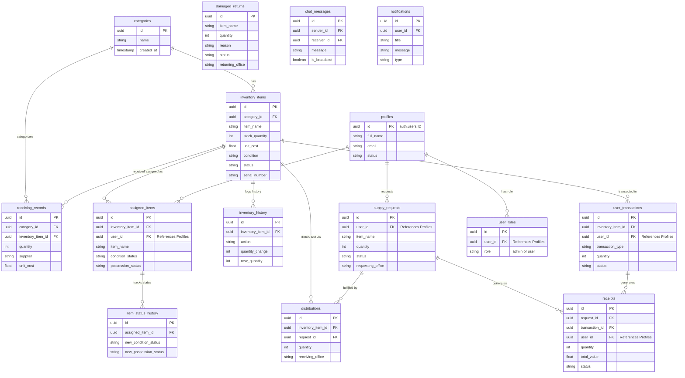

# Database Entity Relationship Diagram

This diagram visualizes the primary tables and their relationships within the supply inventory system based on your Supabase schema.

```mermaid
erDiagram
    %% Relationships
    categories ||--o{ inventory_items : "has"
    categories ||--o{ receiving_records : "categorizes"
    
    inventory_items ||--o{ assigned_items : "assigned as"
    inventory_items ||--o{ distributions : "distributed via"
    inventory_items ||--o{ inventory_history : "logs history"
    inventory_items ||--o{ receiving_records : "received as"
    inventory_items ||--o{ user_transactions : "transacted in"
    
    assigned_items ||--o{ item_status_history : "tracks status"
    
    supply_requests ||--o{ distributions : "fulfilled by"
    supply_requests ||--o{ receipts : "generates"
    
    user_transactions ||--o{ receipts : "generates"
    
    profiles ||--o{ assigned_items : "receives"
    profiles ||--o{ supply_requests : "requests"
    profiles ||--o{ user_roles : "has role"

    %% Table Definitions
    categories {
        uuid id PK
        string name
        timestamp created_at
    }
    
    inventory_items {
        uuid id PK
        uuid category_id FK
        string item_name
        int stock_quantity
        float unit_cost
        string condition
        string status
        string serial_number
    }
    
    assigned_items {
        uuid id PK
        uuid inventory_item_id FK
        uuid user_id FK "References Profiles"
        string item_name
        string condition_status
        string possession_status
    }
    
    item_status_history {
        uuid id PK
        uuid assigned_item_id FK
        string new_condition_status
        string new_possession_status
    }
    
    supply_requests {
        uuid id PK
        uuid user_id FK "References Profiles"
        string item_name
        int quantity
        string status
        string requesting_office
    }
    
    distributions {
        uuid id PK
        uuid inventory_item_id FK
        uuid request_id FK
        int quantity
        string receiving_office
    }
    
    receipts {
        uuid id PK
        uuid request_id FK
        uuid transaction_id FK
        uuid user_id FK "References Profiles"
        int quantity
        float total_value
        string status
    }
    
    receiving_records {
        uuid id PK
        uuid category_id FK
        uuid inventory_item_id FK
        int quantity
        string supplier
        float unit_cost
    }
    
    user_transactions {
        uuid id PK
        uuid inventory_item_id FK
        uuid user_id FK "References Profiles"
        string transaction_type
        int quantity
        string status
    }
    
    profiles {
        uuid id PK "auth.users ID"
        string full_name
        string email
        string status
    }
    
    user_roles {
        uuid id PK
        uuid user_id FK "References Profiles"
        string role "admin or user"
    }
    
    damaged_returns {
        uuid id PK
        string item_name
        int quantity
        string reason
        string status
        string returning_office
    }
    
    inventory_history {
        uuid id PK
        uuid inventory_item_id FK
        string action
        int quantity_change
        int new_quantity
    }
    
    chat_messages {
        uuid id PK
        uuid sender_id FK
        uuid receiver_id FK
        string message
        boolean is_broadcast
    }
    
    notifications {
        uuid id PK
        uuid user_id FK
        string title
        string message
        string type
    }
```
